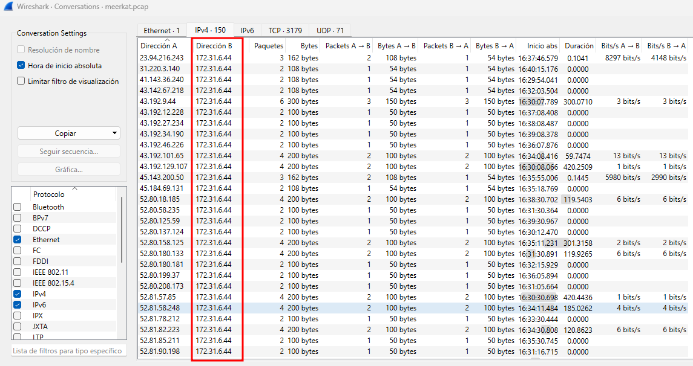
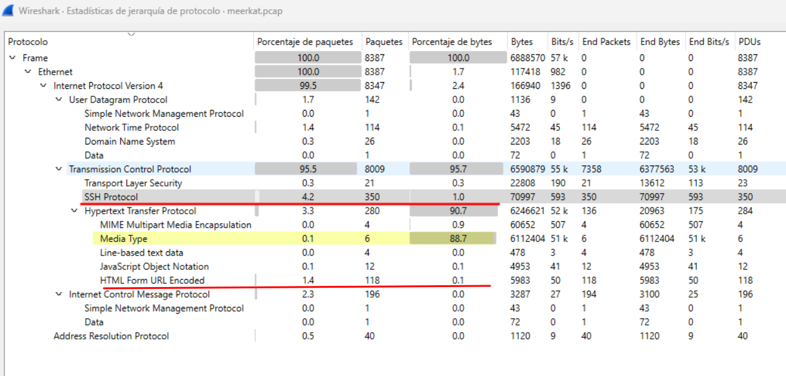
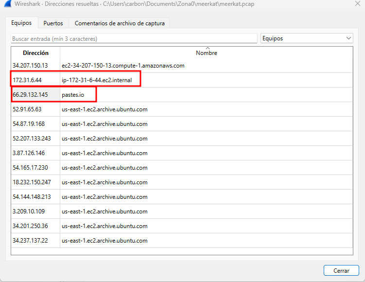
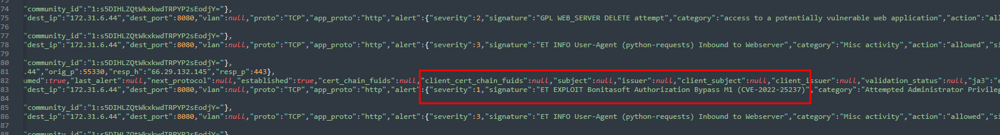

## DESCRIPCIÓN DEL RETO (Traducción oficial)
Como empresa emergente de rápido crecimiento, Forela ha estado utilizando una plataforma de gestión empresarial. Desafortunadamente nuestra documentación es escasa y nuestros administradores no son los más conscientes de la seguridad. 

Como nuestro nuevo proveedor de seguridad, nos gustaría que echara un vistazo a algunos PCAP y a los datos de registro que hemos exportado para confirmar si hemos sido (o no) comprometidos.

## Preparación del entorno
Lo primero es descargarnos el archivo meerkat.zip, quedando 2 archivos:
- **meerkat.pcap:** Es una captura de tráfico entre clientes y la aplicación.
- **meerkat-alerts.json**: Es el archivo de alertas de la aplicación monitorizado con un IDS, como puede ser Suricata.

## Enumeración básica 
Lo primero que tenemos que entender es lo que estamos viendo y no empezar a responder preguntas como locos, así que planteo mis propias preguntas:

### Equipos
*1. ¿Qué equipos están interactuando?*

Para esto nos vamos a Estadisticas > Conversaciones y en ipv4 vemos facillmente las direcciones ip:
- 172.31.6.44: Vemos que es la principal siempre por lo que entendemos que es el servidor. Otro punto importante es saber que es un rango privado tipo B, 172.16.0.0 a 172.31.255.255.
- El resto de ips vemos que son ips publicas de una forma clara y bastante diversas a primera vista.



### Protocolos
*2. ¿Qué protocolos se están utilizando?*

También algo que nos aportará mucha información de inicio es saber el tipo de comunicación utilizada.
En la imagen siguiente se ve que el tráfico 95% es HTTP y de tipo "media".
También vemos 350 paquetes de SSH que habrá que revisar.
Y una parte a revisar es la URL encoded, ya que podría ser motivo de una reverse shell.


### ips
Al ser tráfico HTTP me gusta también saber si hay resoluciones de los equipos, para descartar ips de repositorios y otras web de contenido de terceros
Para eso vamos a Estadisticas > Direcciones resueltas.
- Muy interesante conocer que el nombre de equipo de la ip 172.31.6.44 es "ip-172-31-6-44.ec2.internal"
- Sospechoso también pastes.io 


Si es tráfico HTTP nos interesa conocer las peticiones, y una forma rapida de verlas organizadas es en: *Estadisticas > HTTP > Peticiones*
Aquí vemos que ha habido acceso a la API bonita (provee REST y API Java para interactuar en el runtime)
"i18translation" lo veremos en detalle después que es el exploit que explota el atacante.
Y nos encontramos la interacción de la shell y controlada por el atacante.


Vamos a ir directamente a por el atacante, con la URI extraída de la reverse shell hacemos una busqueda.
```shell
http.request.uri contains "/bonita/API/extension/rce?p=0&c=1&cmd=bash%20bx5gcr0et8"
```

Ip sospechosa del atacante que sí que logro acceso: 138.199.59.221


Además es la misma ip que lanza el exploit que vemos en meerkat-alerts.json


----
### Tarea 1
*Creemos que nuestro servidor "Business Management Platform" se ha visto comprometido. 
¿Puede confirmar el nombre de la aplicación que se está ejecutando?*
Para conocer el nombre de la aplicación lo da de una forma muy sencilla el CVE, ya que explota una vulnerabilidad de esta aplicación. "*Bonitasoft*", que tenemos justo arriba.

Si buscamos más sobre Bonitasoft, vemos que es una plataforma de codigo abierto para automatización de procesos. 
![[Pasted image 20240218113715.png|700]]
Fuente: https://es.bonitasoft.com/


### Tarea 2
*¿Creemos que el atacante puede haber utilizado un subconjunto de la categoría de ataque de fuerza bruta: ¿Cómo se llama el ataque llevado a cabo?*
Centremonos ya que hay mucha información y esta pregunta es compleja: Necesitamos averiguar como ha explotado el login.

Haciendo un filtro muy simple, por "http", vemos la cantidad de peticiones HTTP que hay 
```shell
http
```

![[Pasted image 20240218122653.png]]

Elegimos una de estas peticiones y botón derecho "Seguir >HTTP Stream"
Podemos ver que tenemos en este caso la comunicación de 2 intentos de login de credenciales mediante www-form-urlencoded
![[Pasted image 20240218122922.png]]

A este ataque se conoce como **Credential Stuffing** (Relleno de credenciales) que consiste en el relleno de credenciales en formularios de inicio de sesión. Suele ser habitual probar las contraseñas más comunes utilizadas o si hay una brecha conocida de alguna filtración y se quieren probar si alguna credencial es valida.
Fuente: https://owasp.org/www-community/attacks/Credential_stuffing
![[Pasted image 20240218123252.png]]


### Tarea 3
*¿La vulnerabilidad explotada tiene un CVE asignado? En caso afirmativo, ¿cuál?*
CVE-2022-25237
![[Pasted image 20240217104952.png]]

##### Bonus: Conociendo que hace el CVE-2022-25237
Bonita Web 2021.2 tiene una vulnerabilidad con RCE (Remote Code Execution) y una puntuación crítica de 9.8 
Como nos dice el reporte i18ntranslation o /../i18ntranslation/ al final de una URL se hace un bypass
![[Pasted image 20240218112147.png|700]]
Fuente: https://nvd.nist.gov/vuln/detail/CVE-2022-25237


### Tarea 4 
*¿Qué cadena se agregó a la ruta URL de la API para evitar el filtro de autorización del exploit del atacante?*
Si hemos enumerado bien y conocemos los ataques vereis que estas preguntas se contestan de forma sencilla.
Buscamos de forma rápida "http" y nos situamos donde se está utilizando el exploit CVE-2022-25237, conocemos que es "*i18ntranslation*"
![[Pasted image 20240218123821.png]]

Y si seguimos esta petición como anteriormente "Seguir > HTTP Stream" veremos como al explotar el i18translation sube el 
![[Pasted image 20240218124108.png]]


### Tarea 5
*¿Cuántas combinaciones de nombres de usuario y contraseñas se utilizaron en el ataque de relleno de credenciales?*
Esto vamos a tener que afinar bien el filtrado:

Empezamos aplicando este filtro para ver los paquetes enviados desde el panel de login.
```shell
http.request.uri contains "/bonita/loginservice"
```
![[Pasted image 20240218135803.png]]

Paso 2: Añadir la columna de credenciales
Para este paso seleccionamos una petición y en el "value" de la credenciales lo aplicamos como columna. Como vereis en la imagen tiene que añadirse en Wireshark de esta forma.
![[Pasted image 20240218140044.png]]

##### Paso 5: Seleccionar valores únicos
Yo lo que he hecho es ordenar por "Lenght", pero más acertado es por Value.
Seleccionamos todos los resultados y vamos deseleccionando valores repetidos, así como el install-install, que de 118 nos quedamos en *56 combinaciones*.
![[Pasted image 20240218141514.png]]


### Tarea 6
*¿Qué usuario y contraseña era correcta?*
Nos situamos en el último intento de la pantalla anterior y hacemos el HTTP Stream.
Vemos como hay un código 401 (petición no ejecutada) y un código 204 (Sin contenido ) configurandose una cookie de sesión.
Solución: seb.broom@forela.co.uk:g0vernm3nt
![[Pasted image 20240218142036.png]]

### Tarea 7
*En su caso, ¿Qué sitio para compartir texto utilizó el atacante?*
Esto lo vimos al inicio, es lo que tiene enumerar bien, ¿Os acordáis como se descargaba el texto?
Volvemos a revisarlo con: Estidisticas > HTTP > Peticiones, viendo: *pastes.io*

![[Pasted image 20240218150116.png]]

### Tarea 8
*Proporcione el nombre de archivo de la llave publica usada por el atacante para conseguir persistencia en nuestro host?*
Seguimos tirando del hilo y visitamos este recurso web: https://pastes.io/raw/bx5gcr0et8
Vemos que es un script de bash, que lo que hace es añadir lo que hay en otro pastes.io al fichero con las claves de ssh, así poder acceder con ubuntu de forma directa.
![[Pasted image 20240218152313.png]]

Por lo que la solución es el nombre de la clave de registro: *hffgra4unv*


### Tarea 9 
*¿Puedes confirmar el archivo modificado por el atacante para conseguir persistencia?*
Con la investigación anterior ya tenemos claro que se modificó el authized keys del usuario ubuntu.
*/home/ubuntu/.ssh/authorized_keys*


### Tarea 10
*¿Puedes confirmar el ID tecnica MITRE de este tipo de mecanismo de persistencia?*
Buscamos en internet sobre ssh authorized keys y muy rapidamente encontramos en la pagina de MITRE.

Fuente: https://attack.mitre.org/techniques/T1098/004/
![[Pasted image 20240218153941.png]]

Y ya hemos acabado el sherlock, como veis ha sido bastante sencillo aunque si no has utilizado Wireshark a menudo puede haberte costado algo más ;) ¡Enhorabuena!
