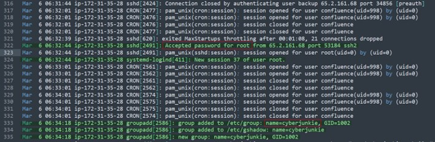

# Brutus
Plataforma: Hackthebox

Reto: Sherlock

Dificultad: Muy Fácil

Categoria: DFIR

Enlace: https://app.hackthebox.com/sherlocks/Brutus/

## DESCRIPCIÓN DEL RETO (Traducción oficial)
En este Sherlock Holmes muy fácil, te familiarizarás con los registros auth.log y wtmp de Unix. Exploraremos un escenario en el que **un servidor Confluence fue atacado por la fuerza bruta a través de su servicio SSH.** Después de obtener acceso al servidor, el atacante realizó actividades adicionales, que podemos rastrear usando auth.log. Aunque auth.log se usa principalmente para el análisis por fuerza bruta, profundizaremos en todo el potencial de este artefacto en nuestra investigación, incluidos aspectos de escalada de privilegios, persistencia e incluso cierta visibilidad en la ejecución de comandos.

## Preparación del entorno
Lo primero es descargarnos el archivo brutus.zip, quedando 2 archivos:
- **auth.log:** Es un archivo de registro (log) que contiene eventos relacionados con la autenticación y la seguridad del sistema. (se ubica en /var/log/auth.log (puede variar según la distribución).
-   Contiene: Intentos de inicio de sesión (éxitos y fallos) || Cambios de contraseñas || Uso de sudo || Actividad del servicio SSH (conexiones y desconexiones).
- **wtmp**: Es un archivo binario que almacena un registro histórico de inicios y cierres de sesión, reinicios y apagados del sistema. (se ubica en /var/log/wtmp).
-   Contiene: Usuarios que inician sesión y cierran sesión.|| Reinicios y apagados del sistema. || Cambios de nivel de ejecución.

Para esta práctica se puede hacer sencillamente con Windos o Linux.

## Tarea 1
**Al analizar el auth.log, ¿puede identificar la dirección IP utilizada por el atacante para realizar un ataque de fuerza bruta?**

Abrimos el archivo auth.log con nuestro editor preferido.
Entendemos lo que pone:
> Vemos intentos de sesión desde la ip (65.2.161.68) probando diferentes usuarios: admin, user, backup, server_adm, svc_account, con ataques de fuerza bruta.

```
Mar  6 06:31:33 ip-172-31-35-28 sshd[2327]: Failed password for invalid user admin from 65.2.161.68 port 46392 ssh2
Mar  6 06:31:33 ip-172-31-35-28 sshd[2331]: Failed password for invalid user admin from 65.2.161.68 port 46436 ssh2
Mar  6 06:31:33 ip-172-31-35-28 sshd[2332]: Failed password for invalid user admin from 65.2.161.68 port 46444 ssh2
Mar  6 06:31:33 ip-172-31-35-28 sshd[2335]: Failed password for invalid user admin from 65.2.161.68 port 46460 ssh2
```

## Tarea 2
**Los intentos de fuerza bruta tuvieron éxito y el atacante obtuvo acceso a una cuenta en el servidor. ¿Cuál es el nombre de usuario de esta cuenta?**
Para responder esta tarea debemos colocarnos en la primera vez que tuvo un acceso correcto desde la ip: 65.2.161.28 y localizamos que fue desde la cuenta de **root** 
```

```




## Tarea 3
**¿Puedes identificar la marca de tiempo en la que el atacante inició sesión manualmente en el servidor para llevar a cabo sus objetivos?**


----
# Resumen de soluciones
1) **Al analizar el auth.log, ¿puede identificar la dirección IP utilizada por el atacante para realizar un ataque de fuerza bruta?**
65.2.161.68
2) **Los intentos de fuerza bruta tuvieron éxito y el atacante obtuvo acceso a una cuenta en el servidor. ¿Cuál es el nombre de usuario de esta cuenta?**
root
3) **¿Puedes identificar la marca de tiempo en la que el atacante inició sesión manualmente en el servidor para llevar a cabo sus objetivos?**
   
4) **Las sesiones de inicio de sesión SSH se rastrean y se les asigna un número de sesión al iniciar sesión. ¿Cuál es el número de sesión asignado a la sesión del atacante para la cuenta de usuario de la pregunta 2?**
   
5) **El atacante agregó un nuevo usuario como parte de su estrategia de persistencia en el servidor y le otorgó a esta nueva cuenta de usuario mayores privilegios. ¿Cómo se llama esta cuenta?**
   
6) **¿Cuál es el ID de la subtécnica MITRE ATT&CK que se utiliza para la persistencia?**
    
7) **¿Cuánto duró la primera sesión SSH del atacante según el tiempo de autenticación confirmado previamente y la finalización de la sesión dentro del archivo auth.log? (segundos)**
    
8) **El atacante inició sesión en su cuenta de puerta trasera y utilizó sus privilegios superiores para descargar un script. ¿Cuál es el comando completo que se ejecuta con sudo?**
