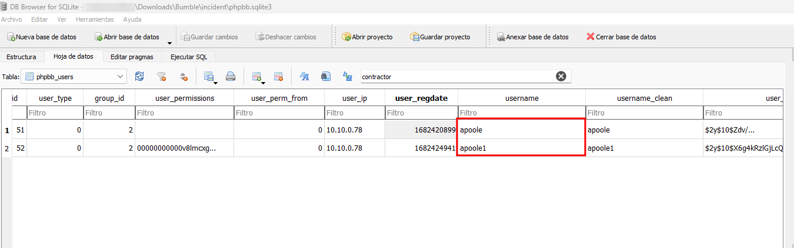
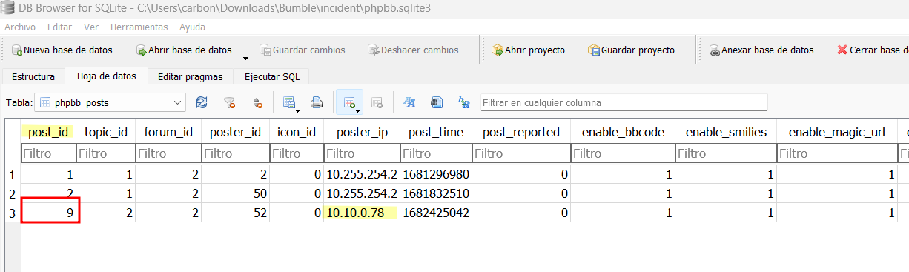
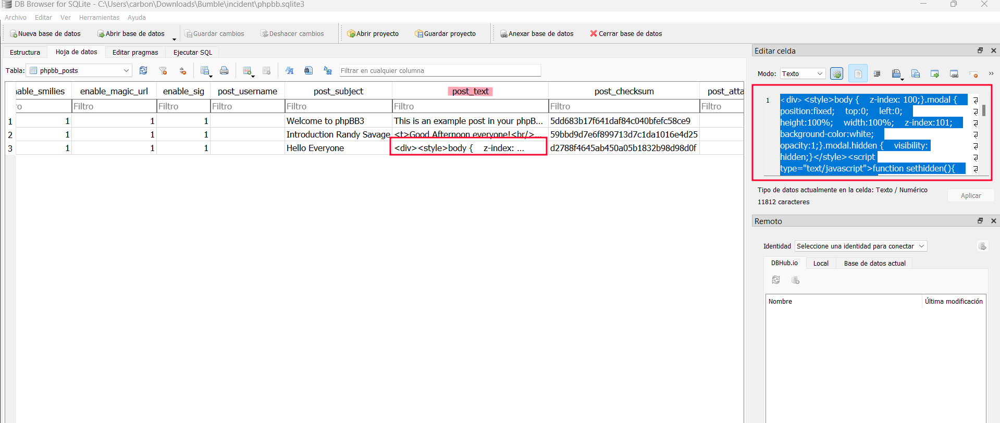
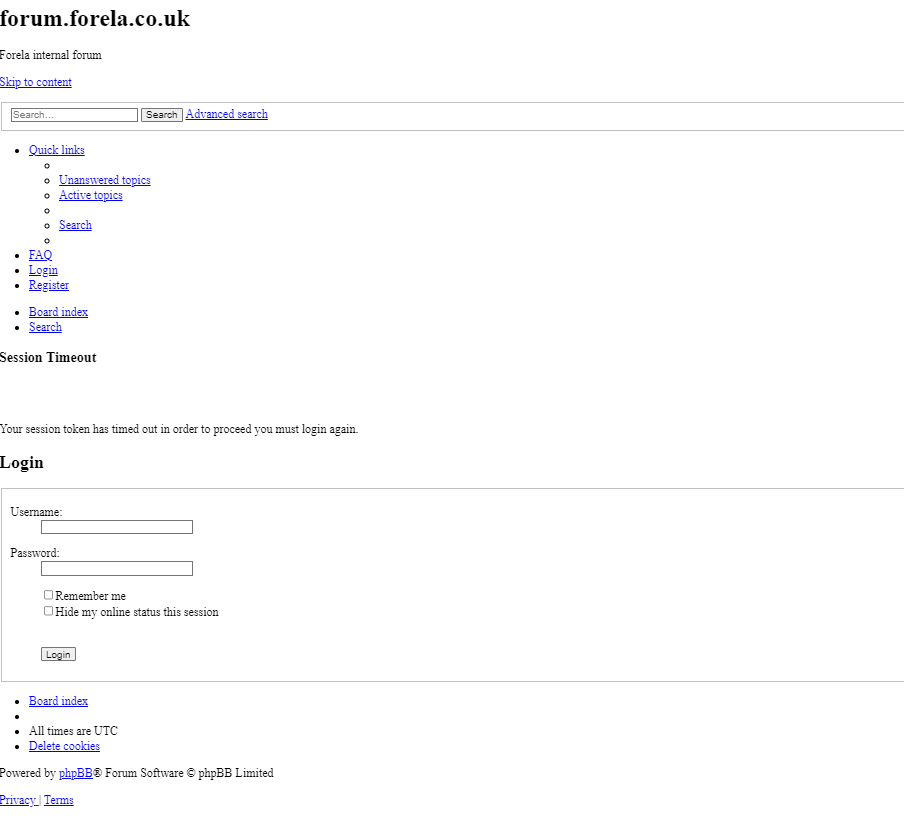
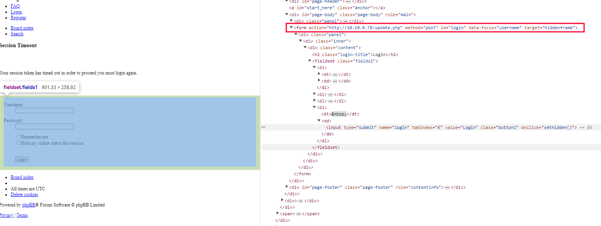
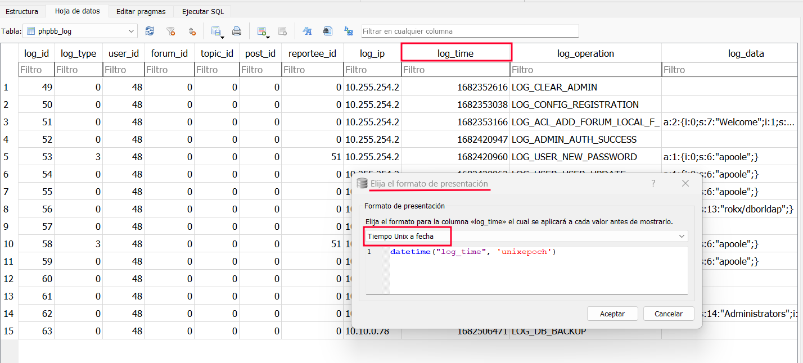
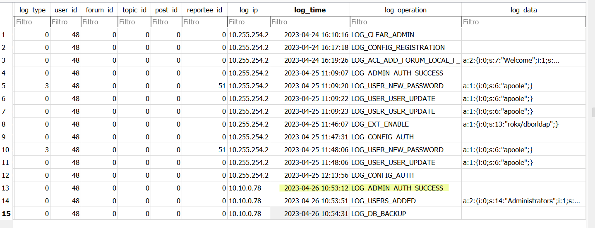
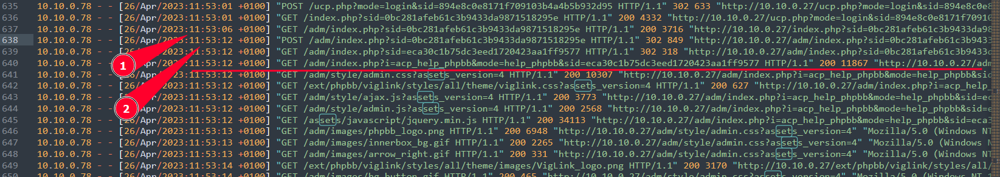
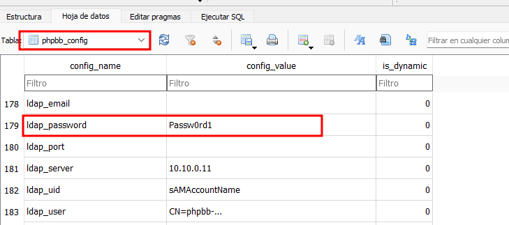
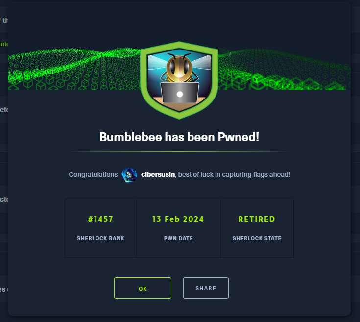

# Bumblebee
Plataforma: Hackthebox

Reto: Sherlock

Dificultad: Fácil

Categoria: DFIR

Enlace: https://app.hackthebox.com/sherlocks/Bumblebee

## DESCRIPCIÓN DEL RETO (Traducción oficial)
¡Un contratista externo ha accedido al foro interno aquí en Forela a través del *WiFi para invitados* y parece tener *credenciales robadas para el usuario administrativo*!
Adjuntamos algunos registros del foro y un volcado de base de datos completo en formato sqlite3 para ayudarlo en su investigación.

## Preparación del entorno
Lo primero es descargarnos el archivo bumble, quedando 2 archivos:
- **phpbb.sqlite3:** Es la base de datos del foro, en formato SQLite que podemos abrir con "DB Browser for SQlite"
- **access.log**: Es el archivo de registro donde están las solicitudes realizadas al servidor web.

Yo lo voy a hacer con un sistema operativo Windows, ya que es un ejercicio de leer y comprender logs, pero sí tú eres de distribuciones forenses (Caine, Tsurugi, Sans) pues adelante, tenemos que llegar a las mismas conclusiones.

## Tarea 1
**¿Cuál es el usuario de nombre de usuario de contratista externo?**

Para acceder a este registro tendremos que abrir el phpbb.sqlite3 con el software que utilicemos, en mi caso: DB Browser for SQLite como os he mencionado anteriormente, pero eso a gusto personal.

Seleccionamos la tabla: phpbb_users y nos aparecen los nombres en la columna: username.



## Tarea 2
**¿Cuál es la dirección que utilizó el contratista para la creación de su cuenta?**

Esta es muy sencilla, en la misma tabla que mostramos arriba tenemos la ip en la columna "user_ip"


## Tarea 3 
**¿Cuál es el post_ID de la publicación maliciosa que hizo el contratista?**

Si nos dicen "post_id" nos vamos a buscar una tabla que sea de posts, y encontramos "phpbb_posts".
Correlacionamos la ip que hemos visto que pertenecia al contratista y vemos que el registro asociado es: 9.



## Tarea 4
**¿Cuál es la URI completa que el ladrón de credenciales envía sus datos?**

Al final de esta misma tabla podemos ver el campo post_text.
Nos copiamos el contenido o lo descargamos, en mi caso lo llamo post.html



Al abrir el archivo HTML con el navegador este es el resultado: Un menú, un buscador y un panel de login.


Pero sí vemos el código fuente detectaremos que el formulario se envía a la propia ip del contratista, y se ha cargado un update.php.


Al hacer click en "Login" nos aparece el siguiente mensaje:
```
Greetings everyone,  
  
I am just a visiting IT Contractor, it's a fantastic company y'all have here.  
I hope to work with you all again soon.  
  
Regards,  
Alex Poole
```

_Observación para comprender mejor_
La función sethidden() que se lanza al hacer click en "Login" comprueba la existencia de una cookie llamada "phpbb_token".
Se genera una cookie que añade 24 horas y cambia el atributo "hidden" a true.
A este ataque se le llama: robo de cookie o secuestro de sesión, en este caso utilizando la tecnica de Man in the middle.


## Tarea 5
**¿Cuándo el contratista inició sesión al foro como administrador (UTC)**

Si queremos saber inicios tendremos que ir a por logs, así que nos ubicamos en la *tabla "phpbb_log"*, y vemos una columna que es *log time*. ¿Bien, no?
Pues como veis el formato es incorrecto, así que tendremos que modificar la columna con *Elija el formato de presentación > Tiempo Unix a fecha*



Ahora vamos a entender el timeline:
- El día 25/4 a las 11:09 desde la ip 10.255.254.2: Se crea una contraseña para apoole, se actualiza el usuario y se habilita la extensión "rokx/dborldap" para que pueda integrarse en servidores LDAP
- El día 26/4 es cuando se autentica desde la ip 10.10.0.78, se añade al grupo Administrators y se guardan los cambios, así conseguir persistencia.

También lo hubiéramos podido extraer en el access.log (pero era más complicado verlo) ya que si nos fijamos bien el foro es *phpbb*, y la página de login es: /admin/index.php y se introduce el SID, y vemos el codigo "200" que es estado exitoso.

** Mucho cuidado que el formato que nos dice Hackthebox es muy estricto, además que es UTC.


## Tarea 6
**¿En el foro hay credenciales en texto plano para la conexión LDAP? ¿Cuál es la contraseña?**

Nos ponemos a buscar donde está configurado LDAP al foro, por lo que vamos a phpbb_config.
Mirando entre todos los campos encontramos ldap_password: y su contraseña en texto plano como nos decían ;) 



## Tarea 7
**¿Cuál es el user-agent del usuario Administrator?**

Ahora sí que toca revisar el access.log para ver las peticiones y nos guiaremos por el formato que nos pide hackthebox.
Lo que buscamos es el login en /adm/index.php ya que entra como administrador. Por lo que lo comprobamos y listo:
```shell
10.255.254.2 - - [25/Apr/2023:12:08:42 +0100] "GET /adm/index.php?sid=ac1490e6c806ac0403c6c116c1d15fa6&i=12 HTTP/1.1" 403 9412 "http://10.10.0.27/adm/index.php?sid=ac1490e6c806ac0403c6c116c1d15fa6&i=1" "Mozilla/5.0 (Macintosh; Intel Mac OS X 10_15_7) AppleWebKit/537.36 (KHTML, like Gecko) Chrome/112.0.0.0 Safari/537.36"
```

## Tarea 8
**¿Cuál es la fecha que el contratista se añadió el mismo al grupo administrador? (UTC)**

Si os acordais esto ya lo hemos analizado anteriormente en la tarea 3 con su imagen.


### Tarea 9 
**¿Cuál es la fecha y hora que el contratista descarga la base de datos? (UTC)**

Tenemos claro por la tarea 3 que empieza la copia el día 26-04-2023 a las 10.54:31, que comprobamos y no funciona, por lo que necesitamos saber la hora de descarga.

Así que nos vamos a partir de las 10.54, agilizamos la busqueda con "backup" y buscamos alguna extensión para saber cuando se descarga el archivo. 
Acabando a las 26/04/2023 11:01:38
```
10.10.0.78 - - [26/Apr/2023:12:01:38 +0100] "GET /store/backup_1682506471_dcsr71p7fyijoyq8.sql.gz HTTP/1.1" 200 34707 "-" "Mozilla/5.0 (Windows NT 10.0; Win64; x64; rv:109.0) Gecko/20100101 Firefox/112.0"
10.
```

## Tarea 10
**¿Cuál es el tamaño en bytes del backup de la base de datos según access.log?**

Esto lo tenemos en la anterior petición: 34707 bytes.

Y ya hemos acabado este divertido Sherlock, espero que os haya gustado y pronto traeré más a este github. ;) 



----
# Resumen de soluciones
1) **¿Cuál es el usuario de nombre de usuario de contratista externo?**
apoole1

2) **¿Cuál es la dirección que utilizó el contratista para la creación de su cuenta?**
10.10.0.78
3) **¿Cuál es el post_ID de la publicación maliciosa que hizo el contratista?**
9
4) **¿Cuál es la URI completa que el ladrón de credenciales envía sus datos?**
http://10.10.0.78/update.php
5) **¿Cuándo el contratista inició sesión al foro como administrador (UTC)**
26/04/2023 10:53:12
6) **¿En el foro hay credenciales en texto plano para la conexión LDAP? ¿Cuál es la contraseña?**
Passw0rd1
7) **¿Cuál es el user-agent del usuario Administrator?**
Mozilla/5.0 (Macintosh; Intel Mac OS X 10_15_7) AppleWebKit/537.36 (KHTML, like Gecko) Chrome/112.0.0.0 Safari/537.36
8) **¿Cuál es la fecha que el contratista se añadió el mismo al grupo administrador? (UTC)**
26/04/2023 10:53:51
9) **¿Cuál es la fecha y hora que el contratista descarga la base de datos? (UTC)**
2023-04-26 11:01:38
10) **¿Cuál es el tamaño en bytes del backup de la base de datos según access.log?**
26/04/2023 10:53:51
